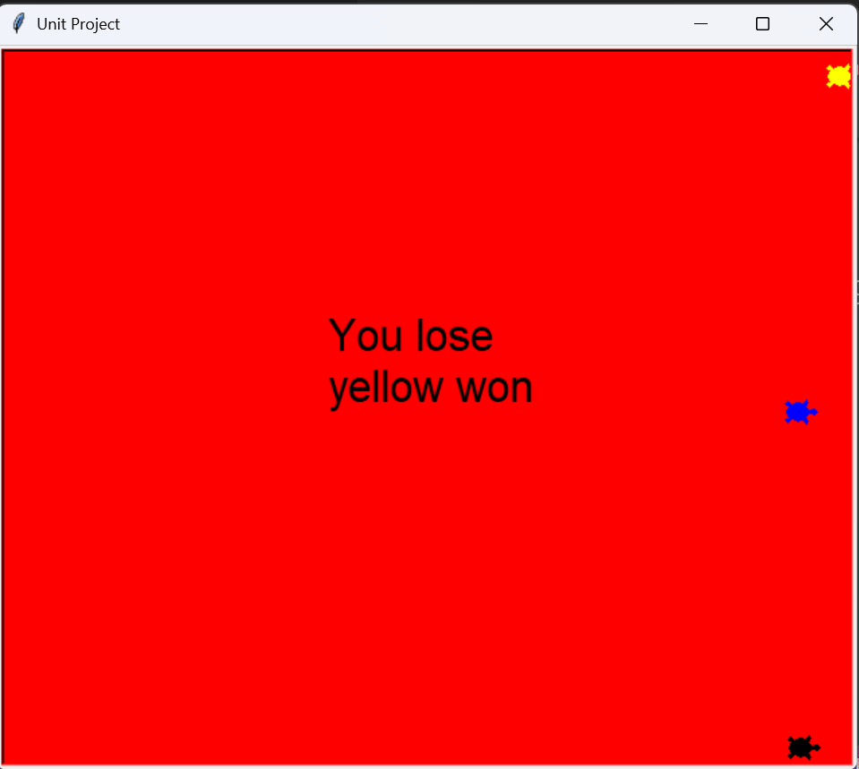
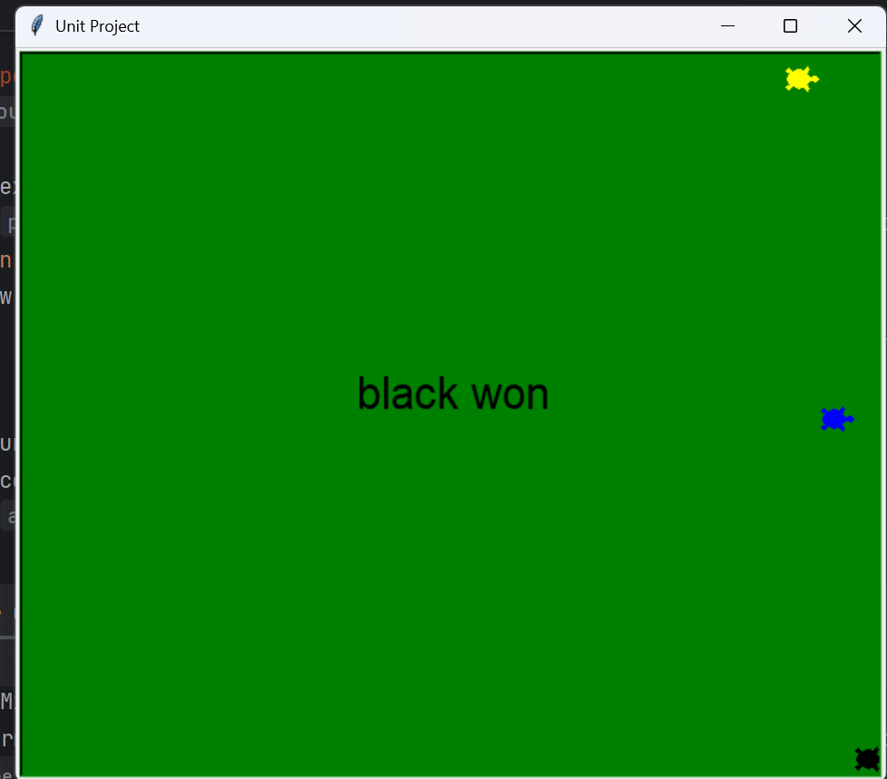

# 🐢 Turtle Racing Game

A fun, interactive turtle racing game built using Python's **Turtle Graphics** module. Users can place a bet on their favorite turtle and watch the race unfold in real-time!

## 🎮 How to Play
1. **Run the script**: The game window will open with a light blue background.
2. **Make your bet**: A popup will ask you to guess the winner (yellow, blue, or black).
3. **Watch the race**: Three turtles will race across the screen at random speeds.
4. **Result**: The background will change to **Green** if you win, or **Red** if you lose, displaying the winner's name.

## 🚀 Features
- **Dynamic Setup**: Automatically calculates turtle positions based on screen height.
- **Input Validation**: Ensures the user enters a valid color before starting.
- **Randomized Logic**: Every race is unique thanks to the `random` library.
- **Clean Code**: Organized using functions and the `if __name__ == "__main__":` block for professional execution.

## 🛠️ Requirements
- Python 3.x
- `turtle` module (built-in with Python)

## 📥 Installation & Running
1. Clone the repository:
   ```bash
   git clone [https://github.com/YOUR_USERNAME/YOUR_REPO_NAME.git](https://github.com/YOUR_USERNAME/YOUR_REPO_NAME.git)

2. Navigate to the project folder, open "turtle race.py" file 
3. Run the game




